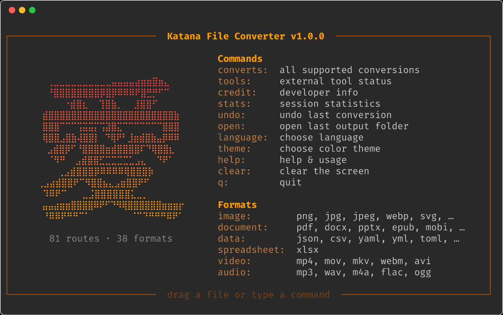
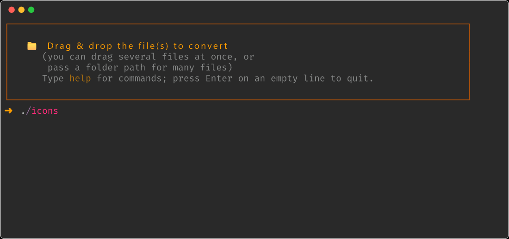

<div align="center">

# 愛 Katana File Converter

A fast, keyboard-friendly file converter that lives in your terminal.

**81 conversion routes · 38 formats** — images, documents, data, spreadsheets, audio & video.




</div>

## Features

- **Drag & drop** — drop one file, several files or a whole folder into the terminal; files are grouped by extension and converted in batch with a live progress bar.
- **CLI mode** — scriptable one-liners for automation (`python main.py photo.png --to ico`).
- **Parallel batches** — `--jobs N` converts a folder across multiple workers.
- **Watch mode** — `--watch ./inbox --to pdf` auto-converts files as they land in a folder.
- **Safe by default** — conflict policy (`--on-conflict overwrite|skip|rename`), a `--dry-run` preview, and one-command **undo** so a bad batch is never permanent.
- **Naming templates** — `--name "{stem}_web.{ext}"` with `stem/ext/parent/index/date` fields.
- **Profiles** — save a whole set of flags once (`--save-profile web`) and reuse it (`--profile web`).
- **Image ops** — `--resize 800x600`/`50%`, corner `--watermark`, quality presets.
- **PDF tools** — merge, page-range extract, compress and rotate (`--merge`, `--pages 1-3`, `--compress`, `--rotate 90`).
- **Archives** — bundle outputs into one file (`--zip-output out.zip`) or `--extract` a zip/tar.
- **Pipe friendly** — `cat in.md | katana - --from md --to html > out.html`.
- **OCR (optional)** — image → searchable text when Tesseract is installed; hidden otherwise.
- **Remembers your choices** — the last target format per extension comes preselected next time.
- **10 color themes** — gradient palettes switchable at runtime with the `theme` command.
- **4 languages** — Turkish, English, German and Spanish; auto-detected from your system.
- **Shell completion & context menu** — `--completion bash|zsh|powershell`, and on Windows `--install-context-menu`.
- **Tool auto-install** — audio & video conversions need ffmpeg; missing tools are detected and offered for install via winget. Everything else is pure Python.

<div align="center">



<em>Drop a folder, pick a format, watch the batch convert.</em>

</div>

## Installation

Requires **Python 3.11+**.

```
git clone https://github.com/ugurckr/katana-file-converter.git
cd katana-file-converter
python -m venv .venv
.venv\Scripts\activate        # Windows  ·  source .venv/bin/activate on macOS/Linux
pip install -r requirements.txt
python main.py
```

On Windows you can also launch it by double-clicking `Katana.bat` once the venv is set up.

Or install it as a command so `katana` works from anywhere:

```
pip install .        # or: pipx install .
katana --help
```

The optional OCR route needs `pip install .[ocr]` plus the [Tesseract](https://github.com/tesseract-ocr/tesseract) binary; it stays hidden until both are present.

## Usage

### Interactive mode

Run `python main.py` with no arguments, then drag files into the window or type a command:

| Command | Description |
| --- | --- |
| `converts` | full conversion matrix |
| `tools` | external tool status |
| `stats` | session statistics |
| `undo` | delete the last conversion's outputs |
| `open` | open the last output folder |
| `language` | switch UI language |
| `theme` | switch color theme |
| `help` | help & usage |
| `q` | quit |

After each conversion, press `o` to reveal the output in your file manager.

### CLI mode

```
python main.py photo.png --to ico          # single file
python main.py .\pictures --to jpg -r      # whole folder, recursive
python main.py song.flac -o out\song.mp3   # custom output path

# Workflow power
python main.py .\pics --to webp --jobs 4 --on-conflict rename
python main.py .\pics --to jpg --name "{stem}_web.{ext}" --dry-run
python main.py --undo                       # revert the last batch
python main.py --watch .\inbox --to pdf     # auto-convert on drop

# Profiles
python main.py --save-profile web --to jpg --quality 82 --jobs 4
python main.py .\pics --profile web

# Image / PDF / archive tools
python main.py logo.png --to jpg --resize 50% --watermark "DRAFT"
python main.py report.pdf --pages 1-3 -o intro.pdf
python main.py .\pdfs --merge -o all.pdf
python main.py .\out --to jpg --zip-output shots.zip
python main.py bundle.zip --extract -o .\unpacked

# Pipe
cat notes.md | python main.py - --from md --to html > notes.html
```

### Shell completion & Windows integration

```
katana --completion bash > ~/.katana-complete && source ~/.katana-complete
katana --completion powershell | Out-String | Invoke-Expression   # PowerShell
katana --install-context-menu      # Windows right-click → “Convert with Katana”
```

## Supported formats

| Category | Source formats |
| --- | --- |
| 🖼 Image | png, jpg, jpeg, webp, svg, heic, icns, ico, gif, bmp, tiff |
| 📄 Document | pdf, docx, pptx, epub, mobi, txt, html |
| 🗂 Data | json, csv, yaml, toml, xml, md, sql |
| 📊 Spreadsheet | xlsx |
| 🎬 Video | mp4, mov, mkv, webm, avi |
| 🎵 Audio | mp3, wav, m4a, flac, ogg |

Type `converts` inside the app for the full source → target matrix. Document and e-book routes (`docx/pptx → pdf`, `mobi → epub`, …) are pure Python and need no external tools. Only audio/video routes need [ffmpeg](https://ffmpeg.org), offered for automatic installation when first needed.

## Configuration

Preferences (language, theme, last used targets, saved profiles) are stored in `~/.katana/config.json`. Conversion history for `undo` lives under `~/.katana/history/`.

## License

[MIT](LICENSE) © 2026 Uğur Çakar
